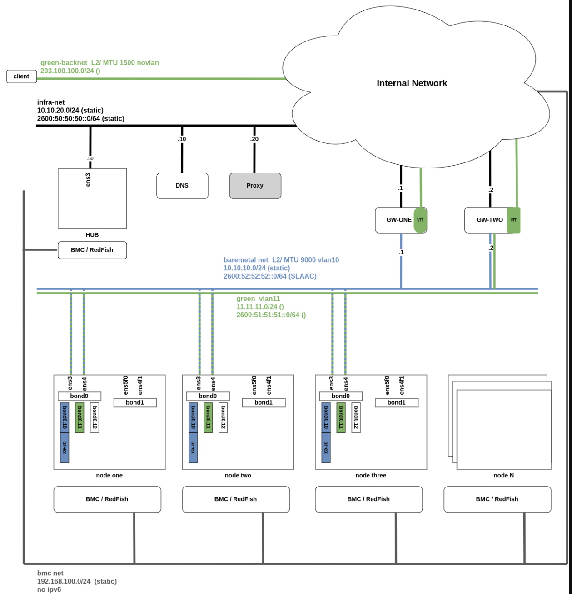

# Agent-based/ZTP on virtual infrastructure

POC on OCP v4.1X.Z with complex network setup

## Network



## Experiments

- Dual stack / Single stack (static, DHCPv4, IPv6 SLAAC, DHCPv6)
- W/o proxy for the connected installation
- RoutingViaHost (=local gateway) (instead of default shared gateway)
- Network tuning e.g MTU 9000k, bond on the primary interface, VLANs on top of bond
- Secondary networks
- More than one Gateway setup (VRRP)
- Operators Metallb, NMState
- MNO with ZTP (spokes)
- SNO with Agent-based & ACM on top (hub)

## Run me

```
ssh root@lab0
dnf -y install libvirt libvirt-daemon-driver-qemu qemu-kvm podman-2:4.6.1-5.el9 git jq conntrack tcpdump bind-utils wireguard-tools
systemctl enable --now libvirtd
systemctl enable --now podman.socket
systemctl disable firewalld && systemctl stop firewalld
hostnamectl set-hostname lab0

echo ip_tables > /etc/modules-load.d/ip_tables.conf
curl https://raw.githubusercontent.com/karmab/kcli/main/install.sh | sudo bash
kcli create pool -p /var/lib/libvirt/images default

git clone https://github.com/karampok/telco-ocp-lab.git
cd telco-ocp-lab
#scp ~/.pull-secret.json ~/.id-rsa.pub root@lab0:/root/telco-ocp-lab
grep -E '\s{10,}' .github/workflows/ztp-compact.yaml | sed 's/^          //'
```

## Podman on RHEL 9.2 / CentOS Stream

```
cp /usr/share/containers/containers.conf /etc/containers/
#enable CNI backend network_backend = "cni"
dnf -y install containernetworking-plugins
sysctl -w net.ipv4.ip_forward=1 # /etc/sysctl.conf
setenforce 0 # libvirt errors

```

## Podman-remote

```
podman system connection add lab0  ssh://root@10.X.Y.Z
podman-remote -c lab0 ps
```

## QEMU v8 on RHEL 9.2

```
dnf install -y python3-pip python3-pip gcc numactl-libs numactl-devel glib2-devel pixman-devel
pip install ninja
git clone -b stable-8.1 https://github.com/qemu/qemu.git && cd qemu/
mkdir build && cd build/
../configure --enable-numa --enable-guest-agent --target-list=x86_64-softmmu --disable-docs
make -j 10
make install
# virsh dumpxml 5gc-w0|grep emulator
```


## Notes

```
# in ci runner
dnf install  podman-2:4.6.0-3.el9 #if not DNS fails
#disable ipv6
# nmcli connection modify enp1s0 ipv6.method "disabled"
# cat /proc/sys/net/ipv6/conf/enp1s0/disable_ipv6
```
