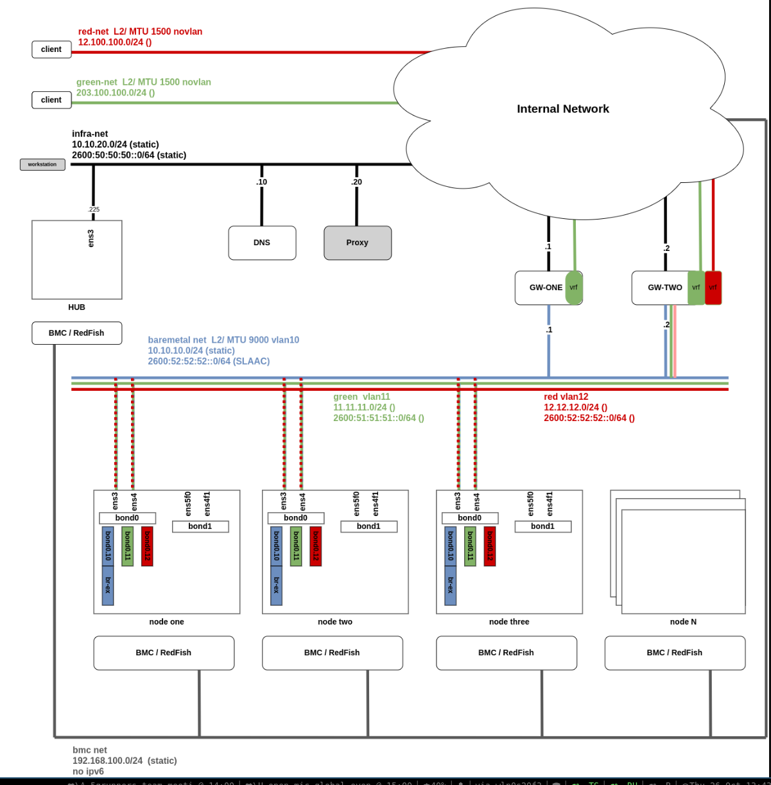

# Agent-based/ZTP on virtual infrastructure

POC on OCP v4.1X.z with complex network setup

## Network



## Experiments

- Dual stack / Single stack  (static, DHCPv4, IPv6 SLAAC, DHCPv6)
- W/o proxy for the connected installation
- RoutingViaHost (=local gateway) (instead of default shared gateway)
- Network tuning e.g MTU 9000k, bond on the primary interface, VLANs on top of bond
- Secondary networks
- More than one Gateway setup (VRRP)
- Operators Metallb, NMState
- MNO with ZTP (spokes)
- SNO with Agent-based & ACM on top (hub)

## Run me

```
ssh root@lab0
dnf -y install libvirt libvirt-daemon-driver-qemu qemu-kvm podman git jq tcpdump bind-utils #wireguard-tools
systemctl enable --now libvirtd
systemctl disable firewalld && systemctl stop firewalld
hostnamectl set-hostname lab0

curl https://raw.githubusercontent.com/karmab/kcli/main/install.sh | sudo bash
kcli create pool -p /var/lib/libvirt/images default

git clone -b dev https://github.com/karampok/telco-ocp-lab.git
#scp ~/.pull-secret.json ~/.id-rsa.pub ~/.github-argo root@lab0:/root/telco-ocp-lab
./sinfra -setupInfra
```

## Wireguard on RHEL 8.X

```
dnf -y install https://www.elrepo.org/elrepo-release-8.el8.elrepo.noarch.rpm
dnf -y install https://dl.fedoraproject.org/pub/epel/epel-release-latest-8.noarch.rpm
dnf -y install kmod-wireguard wireguard-tools

```
